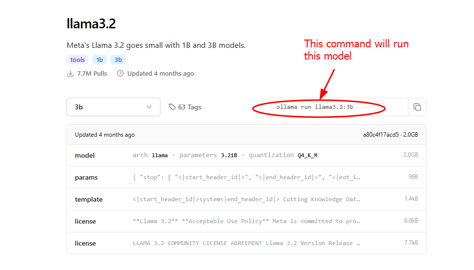

# What's an Ollama
[Ollama](https://github.com/ollama/ollama) is a tool that allows users to run LLM's on hardware of their choosing, rather than being forced into cloud offerings from providers such as OpenAI. This is helpful for cases where you don't want your input corpus shared with arbitrary third parties or for evaluating a variety of models in a consistent way. 

# Using Ollama
The preferred way to use Ollama is via docker. It can be installed directly onto a device but doing so is not covered in the scope of this document.
## Docker
#### Interactively
To run a model interactively and chat with it on the command line use the following command:
```sh
docker run -v ${PWD}/models:/root/.ollama/models --name myollama -it ollama/ollama ollama run llama3.2:3b
```
This command will instantiate the container and pull down the necessary files to run the model locally. The `-v ${PWD}/models:/root/.ollama/models` creates a volume mount to store the model files persistently to avoid repeating large downloads. If the model you wish to run requires GPU acceleration add the `--gpus all` flag to the command. 

#### As a Service
To run Ollama as a background service the command would be modified to:
```sh
docker run -v ${PWD}/models:/root/.ollama/models --name myollama -p 11434:11434 ollama/ollama ollama serve
```
Note the crucial differences, an interactive tty is no longer provided (the removal of `-it`) and we have mapped a port to our local instance to allow for HTTP communication. This version of the command will not inherently pull any models for use. It will use any model files already present in the directory `${PWD}/models`. Additionally models can be pulled by running a docker command like:
```sh
docker run myollama ollama pull llama3.2:3b
```
or by using the API. For more information on pulling models via the API see [[Ollama#API Use |API Use]]

## Docker Compose
To use Ollama as part of a docker compose deployment add the following to your `docker-compose.yaml` under the `services` node
```yaml
ollama:
    container_name: ollama
    hostname: ollama
    restart: no
    image: 'ollama/ollama:latest'
    build:
      context: ollama
      dockerfile: Dockerfile
    # Uncomment These lines and comment out the port mapping if you only
    # want the container to be from inside of the docker network
    # expose:
    #   - 11434
    ports:
      - 11434:11434
    # this line creates a local mount to store pulled models to avoid
    # repeating large downloads
    volumes:
      - '${PWD}/ollama/models:/root/.ollama/models'
    # Uncomment the following lines for nvidia GPU support
    # deploy:
    #   resources:
    #     reservations:
    #       devices:
    #         - driver: nvidia
    #           count: all
    #           capabilities: [gpu]
```
This creates an Ollama container listening on TCP port 11434. It can be interacted with via the API or by executing commands against the container just as in the section above.

### Validate that it is working
To quickly check that that your model is available to Ollama use the following command:
```sh
curl -s localhost:11434/api/tags | jq '.models | .[] | select(.name | contains("<MODEL_NAME>"))'

```
To ensure that the model is providing output you can run a sample query like the following:
```sh
curl -X POST http://localhost:11434/api/generate -d '{
  "model": "<MODEL_NAME>",
  "prompt":"what is your deal?"
}'
```
Note that if you are using a [[Ollama#Hugging Face |GGUF Model from HuggingFace]] the model name will be fully qualified in the form `hf.co/<USER>`

## API Use
Some key API endpoints to be aware of:
### Tags
**Route:** /api/tags
**Verb:** GET
**Parameters:** none
**Use:** Provides data about currently available models in JSON format
**Sample Call:**
```sh
curl -s localhost:11434/api/tags
```

### Generate
**Route:** /api/generate
**Verb:** POST
**Parameters:**
- model - the model to use
- prompt - user supplied text for the model to respond to
**Use:** Generates a single response to a user supplied prompt. This response will not have information about previous context.
**Sample Call:**
```sh
curl -X POST http://localhost:11434/api/generate -d '{
  "model": "llama3.2:3b",
  "prompt":"what is your deal?"
}'
```

### Chat
**Route:** /api/chat
**Verb:** POST
**Parameters:**
- model - the model to use
- messages - a dictionary containing:
  - role - the role of the user originating the message
  - content - content of the current chat entry
**Use:** Generates a response to a user supplied message that considers the ongoing history of messages between the user and the model.
**Sample Call:**
```sh
curl http://localhost:11434/api/chat -d '{
  "model": "llama3.2",
  "messages": [
    { "role": "user", "content": "why do birds suddenly appear?" }
  ]
}'
```
### Third party tools/libraries
- [ollama-python](https://github.com/ollama/ollama-python)
- [ollama-js](https://github.com/ollama/ollama-js)
- [AnythingLLM](https://docs.anythingllm.com)

## Sample Code
This repo contains a set of files that can be used to run an Ollama instance to be used either as a starting point or for experimentation. By default it will pull the models `llama3.2:3b` and `bartowski/Qwen2.5.1-Coder-7B-Instruct-GGUF:Q2_K`, both are relatively small models. If you want to use different models, simply change the `modelnames.txt` file to suit your needs. 
To run the sample:
```sh
docker compose -f ollama-compose.yaml up -d --build
```
This will launch two containers, one to run ollama and a second that uses the API to pull the supplied models. This may take some time depending on the selected models and your internet speed.

# Model Choice

## Ollama registry
Ollama has its own [library](https://ollama.com/library?sort=popular) of models that can be easily accessed through it's cli or api. 


The general form of the command is
```sh
ollama (run|pull) <MODEL_NAME>:<NUMBER_OF PARAMS>
```

## Hugging Face
Ollama can run any model from the [HuggingFace](https://huggingface.co) registry that is in the [GGUF Format](https://medium.com/@vimalkansal/understanding-the-gguf-format-a-comprehensive-guide-67de48848256). On the HuggingFace page for the model you are interested in click on the "Use this model" dropdown if what you see looks llike the image below 


then you should be able to use that model with Ollama. Selecting that item will take you to an ollama `run` command that can be used to invoke the model interactively. If you wish to use that model via the api, it is trivial to convert it to a `pull` command. The general format of this command will be:
```sh
ollama (run|pull) hf.co/<USER>/<MODEL_NAME>[:<QUANTIZATION>]
```
If the `QUANTIZATION` parameter is omitted a default of `Q4_K_M` will be used. For more information on quantization schemes see [[Ollama#Performance Concerns]]

For more information on using GGUF models see [Use Ollama with any GGUF Model on Hugging Face Hub](https://huggingface.co/docs/hub/en/ollama)
## Performance Concerns
The amount of resources required to run an LLM in a performant way can be quite significant. Depending on the number of hyperparameters and the quantization of the model it may not be feasible to run the model on devices without large amounts of RAM or GPU acceleration. As a general rule, you shouldn't expect to be able to run models with more than 7B-8B parameters locally and 1B-3B is probably a better choice. If you need a larger model than this it is probably wise to find a GPU enabled device to run your model.

Shout out to @arichadda for this helpful resource.
[How much GPU VRAM do I need to serve LLama3 70B? - A Simple Solution | Kaggle](https://www.kaggle.com/discussions/general/529079)


